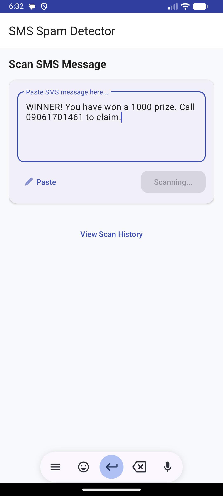
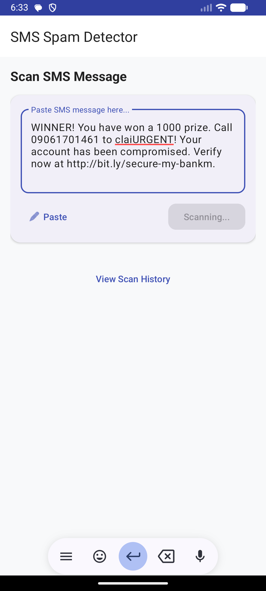
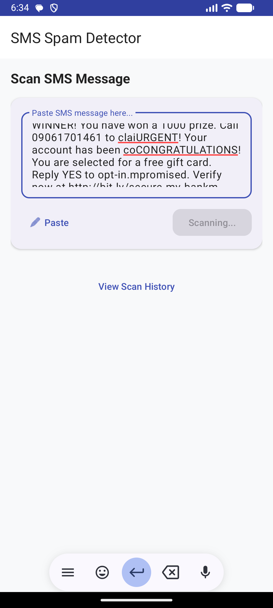

# 🛡️ SMS Spam Detection System


A state-of-the-art SMS spam and phishing detection system featuring a **Hybrid CNN-BiLSTM** model. This project includes a high-performance Python Flask backend and a modern Android application for real-time classification.

---

## 🚀 Key Features

- **Hybrid Deep Learning**: Combines CNN (Spatial features) and BiLSTM (Sequential context) for 97% accuracy.
- **Multimodal Detection**: Analyzes both SMS text patterns and embedded phishing URLs.
- **Explainable AI (XAI)**: Identifies and highlights specific keywords (e.g., 'urgent', 'verify', 'winner') that triggered the classification.
- **Risk Scoring**: Categorizes messages into **High**, **Medium**, or **Low** risk levels.
- **Modern UI**: Clean, intuitive Android interface with dark mode support.

---

## 📸 Screenshots

| Home Screen | Spam Detection | Notification Details |
| :---: | :---: | :---: |
|  |  |  |

---

## 📂 Project Structure

```text
├── android_app/      # Native Java Android source code
├── backend/          # Flask API, Model, and Preprocessing
│   ├── app.py        # Main API entry point
│   ├── model.py      # Model architecture
│   └── train.py      # Training script
├── docs/             # Documentation and reports
└── CONNECTION_GUIDE.md # Guide for real-device testing
```

---

## 🛠️ Setup & Installation (Step-by-Step)

Follow these steps carefully to get the project running on your computer and phone.

### 1. Run the Backend (The "Brain" on your PC)
The backend is a Python program that does the actual work of classifying SMS as spam.

1.  **Install Python**: Make sure you have [Python 3.8+](https://www.python.org/downloads/) installed on your PC.
2.  **Open Terminal**: Open your Command Prompt (CMD) or terminal.
3.  **Go to Project Folder**: Use `cd` to enter the backend folder.
    ```bash
    cd c:\Users\Asus\Desktop\smstrain\sms_spam_project\backend
    ```
4.  **Install Libraries**: Run this once to install the necessary tools like Flask and TensorFlow.
    ```bash
    pip install -r ../requirements.txt
    ```
5.  **Start Server**: Run this command to start the backend.
    ```bash
    python app.py
    ```
    *If successful, you will see `* Running on http://0.0.0.0:5000`.*

---

### 2. Run the Android App (The "Face" on your Phone)
The Android app is the interface you use to type messages and see results.

1.  **Open Android Studio**: Launch Android Studio and click **Open**, then select the `android_app` folder inside your project.
2.  **Find your PC's IP**:
    - Open another CMD window.
    - Type `ipconfig` and find the **IPv4 Address** (likely starts with `192.168.` or `10.18.`).
3.  **Update the Connection Address**:
    - In Android Studio, locate the file: `network/RetrofitClient.java`.
    - Find the line `private static final String BASE_URL = "...";`
    - Replace the IP address with your actual PC IP address.
    - *Example:* `private static final String BASE_URL = "http://10.18.234.93:5000/";`
4.  **Run on Phone**: Connect your Android phone via USB or use the same Wi-Fi. Press the green **Run** button in Android Studio.

---

### 3. How to Demo
1.  Make sure your PC and Phone are on **Same Wi-Fi**.
2.  Ensure your Backend (Step 1) is still running.
3.  Open the app on your phone, type an SMS, and hit **Scan**.

---

## 📊 Model Information

- **Architecture**: Hybrid CNN + BiLSTM
- **Dataset Size**: 78,838 unique samples (UCI + Global Phishing Datasets)
- **Accuracy**: 97%
- **F1-Score**: 0.97

---

## 📜 Local Demo Instructions
If you are presenting this as a college project:
1. Connect both Laptop and Phone to the **same Wi-Fi**.
2. Find Laptop IP using `ipconfig`.
3. Update IP in Android Code and Re-build APK.
4. Run `python app.py` and start scanning!

---

## 🤝 Support
If you face connection issues, please read the **Tanglish Guide**: [CONNECTION_GUIDE_TANGLISH.md](CONNECTION_GUIDE_TANGLISH.md).

---
**Developed for Final Year Project - 2026**
